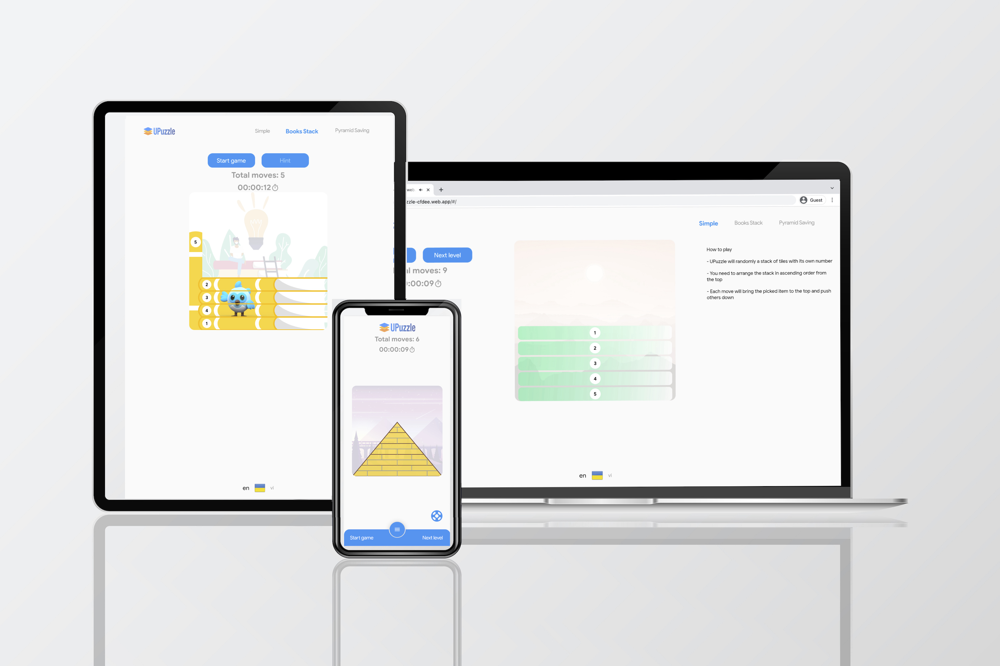

# About
UPuzzle is a simple game by challenge player to solve an unordered stacks with hidden value except top item. Each moving will bring item to the top while pushing others down. 

This game required player to have a good strategy on selecting item as well as good memory on picked items. Game will be solved after all items is sorted in ascending order from top to bottom

# "Try it out" links
[Web app](https://upuzzle-cfdee.web.app)

AppStore & PlayStore coming soon...

## Inspiration
I gifted my little kid a series of cartoon books. Unfortunately, he often mix those books in un-ordered. I challenged him to re-arrange those books (placing in vertical stack) with ascending order. Each time of moving, he have to slide out a book and place it to the top...

UPuzzle have been created with that simple idea. 

## What it does
UPuzzle currently have 3 game modes (**Simple**, **Books Stack**, **Pyramid Saving**) but keep the same playing logic: 
- Game started with a unorder of tiles, books...
- Player can only know value of the top item
- Player will pick out item and place it to the top while others pushing down
- Puzzle will be solved after all items is sorted in ascending order

## How I built it
The UPuzzle was built with Flutter framework which mainly focus on multiple screen size. That's why I've cloned some sources from sample project for responsive layout. 

For **modeling**, the sample project heavily depend on Bloc that I'm currently not familiar like Provider. After days for consideration, I decided to use Provider as main app state management

After setup all the game logic with state management, I can extend the app **view** to other game modes with seperated code base

## Challenges I ran into
I'm not good at design so it really hard to think and imagine like designer. All I have to do is mimic the visual design template to Flutter code using custom painting

Animation also another challenge to this project. 

## Accomplishments that I'm proud of
Extend the game mode to "Pyramid saving" with some simple animation but it works like my original idea.

## What I learned
Besides other things with Flutter that I've already known like state management, implicit animation... I have learned more about responsive layout, advanced animation and custom painting...

## What's next for UPuzzle
I would like to upgrade more features such as Leaderboads, Sharing... and can be published to App Store & Play Store...
